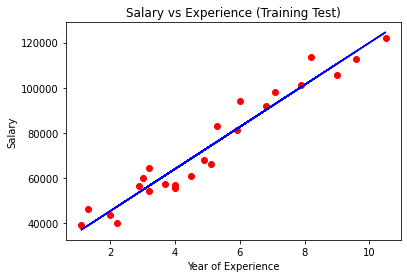
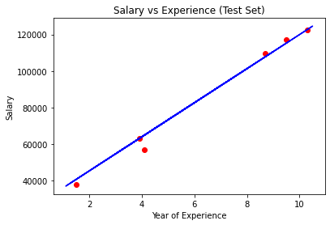

# Simple Liner Regression

## Importing libraries

> Firstly we will import the library which will help in building the model. Below is the code for it:

```
# Import all libraries

import numpy as np
import pandas as pd
import matplotlib.pyplot as plt

```

```
# Import dataset

dataset = pd.read_csv('salary_data.csv')
```

```
dataset.describe()
```
```
dataset.info()
```
```
dataset.head(10)
```
## Extracting dependent and independent Variables

```
X = dataset.iloc[:,:1]
X.head()

y = dataset.iloc[:,1]
y.head()
```

## Spliting the dataset into train set and test set

```
# Spliting the dataset into train set and test set

from sklearn.model_selection import train_test_split

X_train, X_test, y_train, y_test = train_test_split(X, y, test_size=0.2, random_state=0)
```

## Fitting simple linear regression to training set

```
# Fitting simple linear regression to training set

from sklearn.linear_model import LinearRegression

model = LinearRegression().fit(X_train, y_train)

pred = model.predict(X_train)
```

## Visulizing the training set results

```
# Visulizing the training set results

plt.scatter(X_train, y_train, color = 'red')
plt.plot(X_train, pred, color = 'blue')
plt.title("Salary vs Experience (Training Test)")
plt.xlabel("Year of Experience")
plt.ylabel("Salary")

```



## Visualizing the test set results

```
# Visualizing the test set results

plt.scatter(X_test, y_test, color = 'red')
plt.plot(X_train, pred, color = 'blue')
plt.title("Salary vs Experience (Test Set)")
plt.xlabel("Year of Experience")
plt.ylabel("Salary")
```



## Calculate Cofficient and Intercept of the model

```
model.coef_

model.intercept_
```

## Calculate score of model

```
model.score(X_train, y_train)

model.score(X_test, y_test)
```

## Predicting the result of 10 years Experience

```
model.predict([[10]])
```